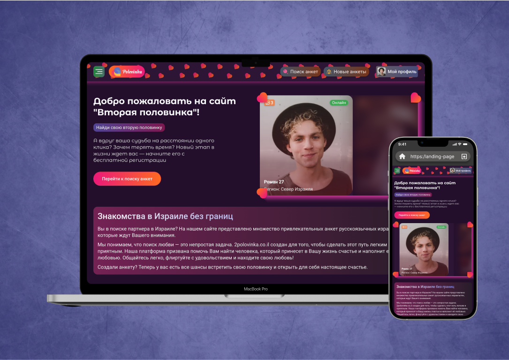

# Dating Website "Polovinka" & Adaptive
Project Overview: "Polovinka" is a modern dating website built using JavaScript and a comprehensive tech stack to offer users an engaging, adaptive online experience. The platform connects people looking for meaningful relationships, combining intuitive UI/UX with powerful JavaScript functionality for smooth interactions.

➼ Technology Stack:
- HTML5 for structure
- CSS3 for styling
- SCSS/Sass for advanced styling and better maintainability
- JavaScript for dynamic functionality
- Gulp for task automation
- Flexbox & Grid for responsive design
- BEM methodology for clean, scalable code

This project showcases adaptive web design and a global JavaScript functionality to ensure a seamless user experience across all devices and screen sizes.
